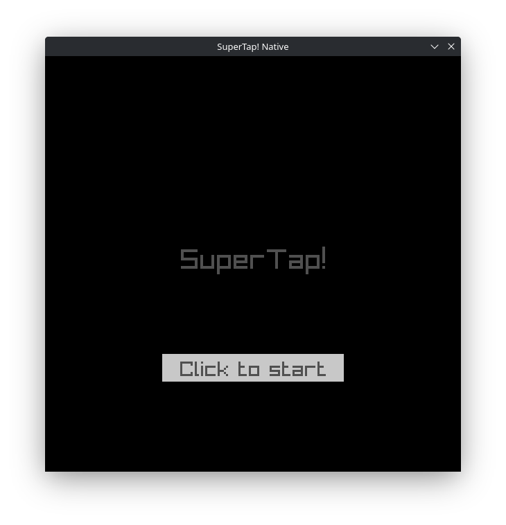
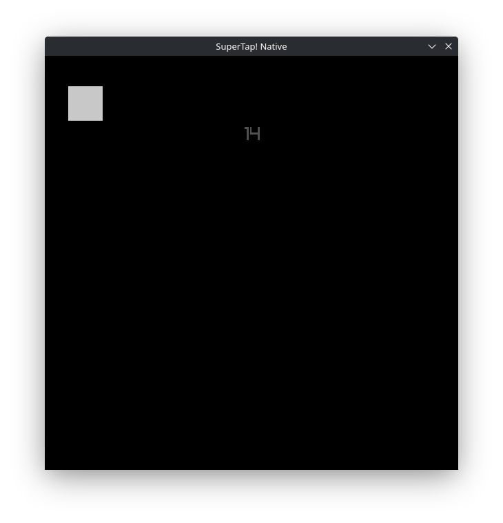
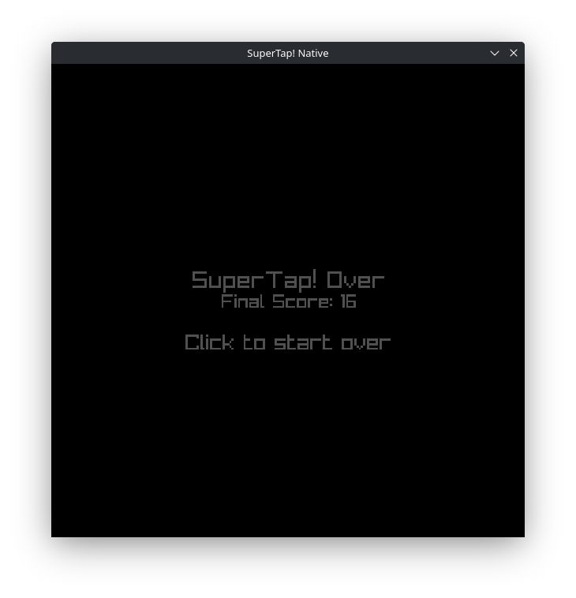

# SuperTap! Native
(IMAGES WIP, EARLY DEVELOPMENT PHOTOS, NOT REPRESENTATIVE OF CURRENT STATE OR FINAL PRODUCT!)
| Main Menu                     | Gameplay                     | End Screen                    |
| ----------------------------- | ---------------------------- | ----------------------------- |
|  |  |  |

## About
An aim-trainer style highscore based game where you have to click the block as many times as you can while its falling from a random position on your screen before it runs out of rounds.
Score is displayed at the top. Inspired by a buddies game from a long time ago. This project serves as a redesign of a port, remake, redesign, and homage of his original concept - and I'm also using it to teach myself Raylib and get a better understanding of Go.

## Dependency Install / Build / Run instructions
Install dependencies: ```$ go get``` \
Build: ```$ go build .``` \
Run: ```$ go run .```
